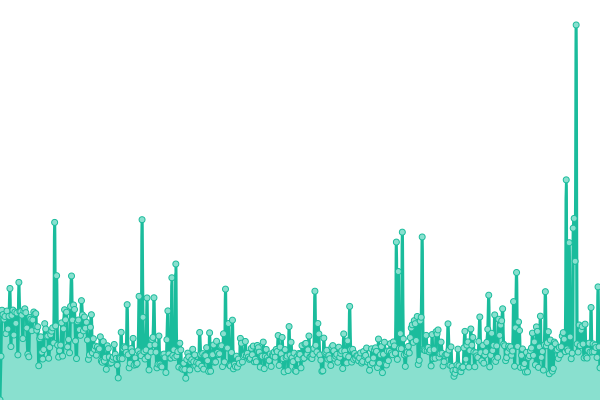
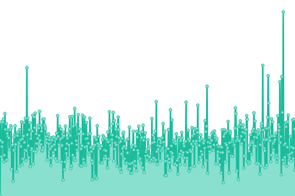
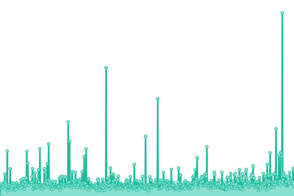
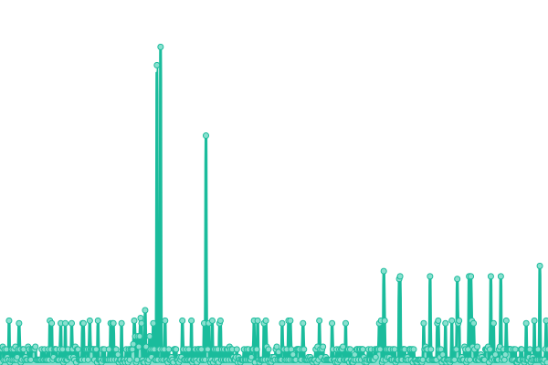

# [📈 Live Status](https://friesipayung.github.io/uptime-w3gg): <!--live status--> **🟩 All systems operational**

This repository contains the open-source uptime monitor and status page for [Friendly](https://friesipayung.github.io/uptime-w3gg), powered by [Upptime](https://github.com/upptime/upptime).

With [Upptime](https://upptime.js.org), you can get your own unlimited and free uptime monitor and status page, powered entirely by a GitHub repository. We use [Issues](https://github.com/friesipayung/uptime-w3gg/issues) as incident reports, [Actions](https://github.com/friesipayung/uptime-w3gg/actions) as uptime monitors, and [Pages](https://friesipayung.github.io/uptime-w3gg) for the status page.

<!--start: status pages-->
<!-- This summary is generated by Upptime (https://github.com/upptime/upptime) -->
<!-- Do not edit this manually, your changes will be overwritten -->
<!-- prettier-ignore -->
| URL | Status | History | Response Time | Uptime |
| --- | ------ | ------- | ------------- | ------ |
|  [W3GG Production Web](https://w3gg.io) | 🟩 Up | [w3-gg-production-web.yml](https://github.com/friesipayung/uptime-w3gg/commits/HEAD/history/w3-gg-production-web.yml) | 

 822ms
     
 | 

<a href="https://friesipayung.github.io/uptime-w3gg/history/w3-gg-production-web">100.00%</a>
    

|  [W3GG Staging Web](https://staging.w3gg.io) | 🟩 Up | [w3-gg-staging-web.yml](https://github.com/friesipayung/uptime-w3gg/commits/HEAD/history/w3-gg-staging-web.yml) | 

 481ms
     
 | 

<a href="https://friesipayung.github.io/uptime-w3gg/history/w3-gg-staging-web">100.00%</a>
    

|  [W3GG Production API](https://w3gg.io/api/status) | 🟩 Up | [w3-gg-production-api.yml](https://github.com/friesipayung/uptime-w3gg/commits/HEAD/history/w3-gg-production-api.yml) | 

 231ms
     
 | 

<a href="https://friesipayung.github.io/uptime-w3gg/history/w3-gg-production-api">100.00%</a>
    

|  [W3GG ICMP](w3gg.io) | 🟩 Up | [w3-gg-icmp.yml](https://github.com/friesipayung/uptime-w3gg/commits/HEAD/history/w3-gg-icmp.yml) | 

 4ms
     
 | 

<a href="https://friesipayung.github.io/uptime-w3gg/history/w3-gg-icmp">100.00%</a>
    

<!--end: status pages-->

[**Visit our status website →**](https://friesipayung.github.io/uptime-w3gg)

## 📄 License

- Powered by: [Upptime](https://github.com/upptime/upptime)
- Code: [MIT](./LICENSE) © [Friendly](https://friesipayung.github.io/uptime-w3gg)
- Data in the `./history` directory: [Open Database License](https://opendatacommons.org/licenses/odbl/1-0/)
